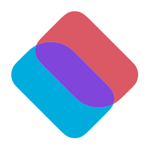

<p align="center"></p>
<h1 align="center">MEUI</h1> 
<h3 align="center">A modern embedded UI library giving your extraordinary development experience<h3>
<h3 align="center">现代嵌入式用户界面库，非凡的开发体验<h3>

<p align="center">
  <a href="https://github.com/ZhUyU1997/MEUI/actions/workflows/node.js.yml"></a>
  
  
</p>

`MEUI` is a modern ui library for embedded platform based on `quickjs` and `React.js`

<p align="center">
  
  
  
  <br>
  
  
  
</p>

## [Example](examples/hello/index.jsx)

```jsx
import { createRoot } from "@meui-js/preact"
import { useState } from "preact/compat"
import { animated, useSpring } from "@meui-js/spring"

function App() {
    const styles = useSpring({
        loop: true,
        from: { rotateZ: 0 },
        to: { rotateZ: 360 },
    })

    const [text, setText] = useState("Hello MEUI!")

    return (
        <animated.View
            style={{
                width: 120,
                height: 120,
                backgroundColor: "#46e891",
                borderRadius: 16,
                textAlign: "center",
                ...styles,
            }}
            onClick={() => {
                setText("Hello MEUI!\nHello React!")
            }}
        >
            {text}
        </animated.View>
    )
}

createRoot(300, 300).render(<App />)
```

## [Browser Demo](https://zhuyu1997.github.io/MEUI/)

## Features

-   Support `React.js` to build UI
-   Support `flex` layout
-   Support partical `css` style
-   Support `Material Design Icons`
-   Support `React Spring` to build animation
-   Support `ES2020`
-   Support `canvas` api

## Getting Started

### [Install Xmake](https://xmake.io/#/getting_started?id=installation)

### Windows

-   #### Download and Install below packages

    [Nodejs 16.x](https://nodejs.org/en/)

    [MinGW-w64 x86_64-posix-seh-rt](https://github.com/niXman/mingw-builds-binaries/releases)

    [SDL2-devel-mingw](https://github.com/libsdl-org/SDL/releases/)

-   #### Add `MinGW` into Environment Variables

-   #### Copy the `SDL2` files to `MinGW`

    ```
    [path to SDL2]\x86_64-w64-mingw32 => [path to MinGW]\x86_64-w64-mingw32
    ```

-   #### Build & Run MEUI

    ```shell
    npm install
    npm run dev
    # Or specified entry
    npm run dev examples/signin/index.tsx
    ```

### Ubuntu/WSLg

-   #### Install `Node.js` & `NPM`

    ```sh
    cd ~
    curl -sL https://deb.nodesource.com/setup_16.x | sudo bash -
    sudo apt -y install nodejs
    node -v
    ```

-   #### Install `GCC` & `Make`

    ```sh
    sudo apt install gcc make
    ```

-   #### Build & Run MEUI

    ```sh
    npm install
    npm run dev
    # Or specified entry
    npm run dev examples/signin/index.tsx
    ```

## API References

### CSS Style

```typescript
export interface MeuiStyle {
    borderRadius?: [number, number, number, number] | number
    borderColor?: string
    backgroundColor?: Property.BackgroundColor
    fontColor?: Property.Color
    text?: string
    fontSize?: number
    fontFamily?: string
    textAlign?:
        | "center-left"
        | "center-right"
        | "center"
        | "top-left"
        | "top-right"
        | "top-center"
        | "bottom-left"
        | "bottom-right"
        | "bottom-center"
    backgroundImage?: string
    contentImage?: string
    transform?: string
    transformOrigin?:
        | [number, number]
        | ["left" | "center" | "right", "top" | "center" | "bottom"]
    flexWrap?: "nowrap" | "wrap" | "wrap-reverse"
    flexDirection?: "row" | "column" | "row-reverse" | "column-reverse"
    alignItems?: "stretch" | "flex-start" | "center" | "flex-end" | "baseline"
    alignSelf?:
        | "auto"
        | "stretch"
        | "flex-start"
        | "center"
        | "flex-end"
        | "baseline"
    alignContent?:
        | "stretch"
        | "flex-start"
        | "center"
        | "flex-end"
        | "space-between"
        | "space-around"
    justifyContent?:
        | "flex-start"
        | "center"
        | "flex-end"
        | "space-between"
        | "space-around"
    margin?: [number, number, number, number] | number
    border?: [number, number, number, number] | number
    padding?: [number, number, number, number] | number
    overflow?: "visible" | "hidden" | "scroll" | "auto"

    flexBasis?: number
    flexGrow?: number
    flexShrink?: number
    width?: Length
    height?: Length
    minWidth?: Length
    minHeight?: Length
    maxWidth?: Length
    maxHeight?: Length
    marginLeft?: Length
    marginTop?: Length
    marginBottom?: Length
    marginRight?: Length
    marginStart?: Length
    marginEnd?: Length
    paddingLeft?: Length
    paddingTop?: Length
    paddingBottom?: Length
    paddingRight?: Length
    paddingStart?: Length
    paddingEnd?: Length
    borderLeft?: number
    borderTop?: number
    borderBottom?: number
    borderRight?: number
    borderStart?: number
    borderEnd?: number
    borderTopLeftRadius?: number
    borderTopRightRadius?: number
    borderBottomRightRadius?: number
    borderBottomLeftRadius?: number
    left?: Length
    right?: Length
    top?: Length
    bottom?: Length
    zIndex?: number
    FOCUS?: MeuiStyle
    ACTIVE?: MeuiStyle
    HOVER?: MeuiStyle
    SELECT?: MeuiStyle
    DISABLE?: MeuiStyle
    CHECK?: MeuiStyle
}
```

## Canvas API

`arc` `arcTo` `beiginPath` `bezierCurveTo` `createRadialGradient` `createLinearGradient` `clearRect` `clip` `closePath` `ellipse` `fill` `fillRect` `fillText` `font` `getImageData` `getTransform` `lineCap` `lineDashOffset` `lineJoin` `lineWidth` `measureText` `Path2D` `putImageData` `quadraticCurveTo` `resetTransform` `rotate` `save` `scale` `setLineDash` `setTransform` `strokeRect` `strokeText` `textAlign` `textBaseline` `transform` `translate`

## Discussion Group

Tencent QQ Group: [765228998](https://jq.qq.com/?_wv=1027&k=LjX7RmEe)

## References

-   QuickJS Javascript Engine. Available at:

    https://bellard.org/quickjs/

-   PlutoVG is a standalone 2D vector graphics library in C. Available at:

    https://github.com/sammycage/plutovg

-   React: A JavaScript library for building user interfaces. Available at:

    https://reactjs.org/

-   react-spring: A spring-physics first animation library. Available at:

    https://react-spring.io/

-   `FlexLayout` is an `C` implementation of `Flexible Box` layout. Available at:

    https://github.com/Sleen/FlexLayout

-   single-file public domain (or MIT licensed) libraries for C/C++. Available at:

    https://github.com/nothings/stb

-   Templated type-safe hashmap implementation in C. Available at:

    https://github.com/DavidLeeds/hashmap

-   `libpqueue` is a generic priority queue (heap) implementation. Available at:

    https://github.com/vy/libpqueue
